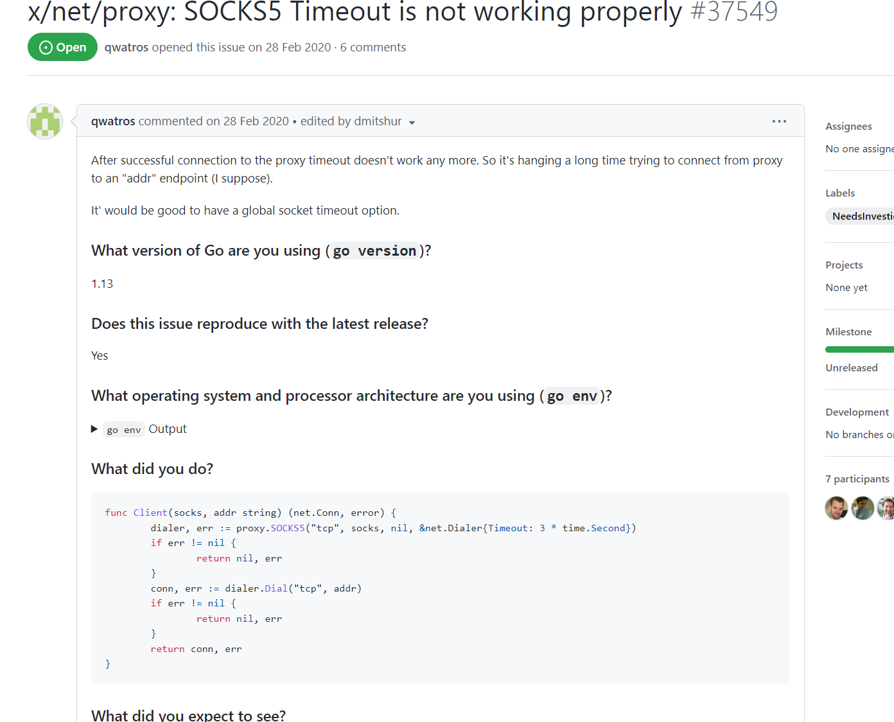

# Gofreeproxy  
白嫖党YES!

配置好config.ini中关于fofa的参数\
usage:
>   -f	使用-f参数可读取当前目录下的proxy.txt，获取其中的代理使用\
-fofa  使用-fofa参数可从fofa收集资产获取公开代理使用\
> -c    使用-c参数可设置验证代理的协程数量，默认为200\
> -t    使用-t参数可设置验证代理的超时时间，默认为10秒\
> 成功后socks代理监听1080端口即可

效果:

修改(bug)日志:
>1.增加了自定义并发数量以及代理存活验证时间 \
2.优化了控制台显示 \
3.修复了从fofa获取代理卡在98%的问题,大概是因为超时机制没生效导致卡顿 \
4.修复了mac下无法读取config.ini以及无法写入proxy.txt的问题 [[fix issues#2]](https://github.com/ja9er/Gofreeproxy/issues/2)\
5.优化控制台显示，修复了覆盖字符串未完全的bug\

